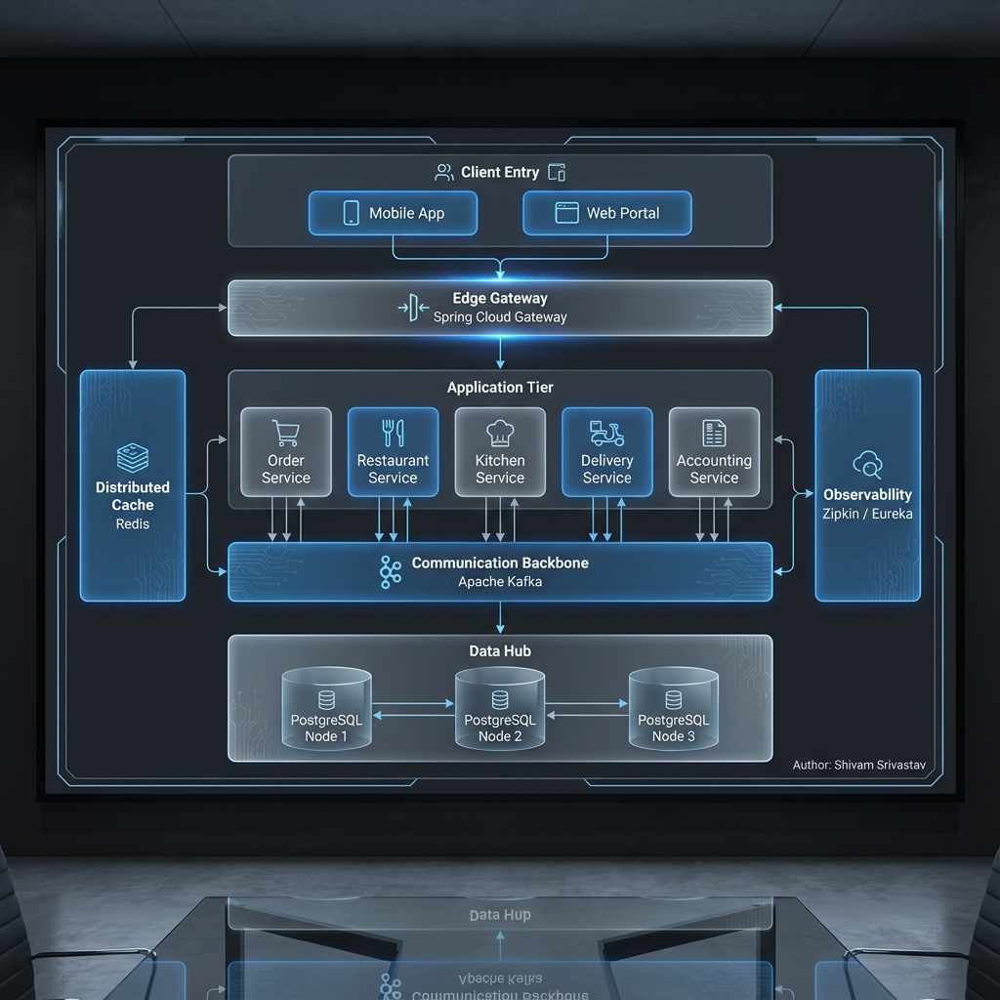
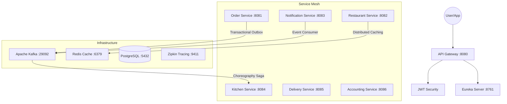

# Restaurant Management System (RMS) - Advanced Distributed Suite

Welcome to the **Restaurant Management System (RMS)**, a premium, enterprise-grade microservices ecosystem designed to handle high-concurrency restaurant operations with extreme reliability and resilience.

## 📖 About the Project

This project is a sophisticated demonstration of modern distributed systems architecture. It goes beyond a simple CRUD application, implementing complex patterns to solve real-world challenges in a distributed environment:

### Core Objectives:
*   **High Availability**: A microservices mesh where each service operates and scales independently.
*   **Data Integrity**: Ensuring consistent state across services using the **Saga Pattern** and **Transactional Outbox**.
*   **Performance**: Sub-millisecond read latency via **Distributed Caching (Redis)** and **CQRS**.
*   **Robustness**: Built-in fault tolerance with **Circuit Breakers** and **Idempotency** for exactly-once processing.

### Why this architecture?
In a typical restaurant environment, order failures or duplicate charges are unacceptable. RMS ensures that every order placed is processed reliably, every menu update is visible instantly, and every system failure is handled gracefully without affecting the user experience.

---

---

## 🏗 System Architecture



### 📊 System Interaction Flow (Mermaid)



The RMS architecture follows the **Database-per-Service** and **Event-Driven** paradigms, ensuring loose coupling and independent scalability.

---

## 🚀 Advanced Patterns Implemented

### 1. **CQRS (Command Query Responsibility Segregation)**
Located in the **Restaurant Service**, we have separated the read and write concerns:
*   **Command Service**: Handles state-changing operations (adding menu items, updating tables) with optimized write logic.
*   **Query Service**: Handles high-speed retrieval of menu and status data, integrated with caching layers.

### 2. **Choreography-based Saga Pattern**
The order lifecycle is managed via an event-driven Saga without a central orchestrator:
*   **Flow**: `Order Placement` ➔ `Outbox Event` ➔ `Kitchen Ticket Received` ➔ `Accounting Entry` ➔ `Notification Sent`.
*   **Reliability**: This ensures the system remains eventually consistent even if individual services are temporarily down.

### 3. **Transactional Outbox Pattern**
Implemented in the **Order Service** to solve the "Dual Write" problem. 
*   Instead of sending to Kafka directly, events are saved in a local `Outbox` table within the same ACID transaction as the Order. 
*   A background `OutboxPoller` ensures "At-Least-Once" delivery to Kafka.

### 4. **Distributed Caching (Read-Aside Pattern)**
*   Utilizes **Redis** to cache the Restaurant Menu.
*   **@Cacheable**: First request triggers a DB lookup; subsequent requests are served in milliseconds from memory.
*   **@CacheEvict**: Automatically invalidates the cache when a Manager updates the menu, ensuring zero stale data.

### 7. **Idempotency Pattern**
*   **Unique Request Handling**: Implemented in **Order** and **Restaurant** services to prevent duplicate records (Orders/Reservations) during network retries.
*   **Idempotency Key**: Clients send a unique `idempotencyKey` in the request header/body. The service checks for its existence in the database before processing.
*   **Safety**: If a request is retried, the system returns the existing record's state instead of creating a new one, ensuring exactly-once processing for business operations.

---

## 📖 API Documentation & Contract
We provide a **Unified OpenAPI 3.1 Specification** that consolidates all microservices into a single contract.
*   **Unified Contract File**: `restaurant-management-api-contract.json`
*   **How to use**: Import this file into Postman, Insomnia, or Swagger Editor to view all endpoints, request payloads (including idempotency keys), and security requirements.

---

## 🛠 Technology Stack

*   **Runtime**: Java 17 / 21
*   **Framework**: Spring Boot 3.4.0, Spring Cloud 2023
*   **Storage**: PostgreSQL (Primary Persistence)
*   **Caching**: Redis
*   **Messaging**: Apache Kafka
*   **Discovery**: Netflix Eureka
*   **Observability**: Micrometer Tracing + Zipkin
*   **Security**: JWT + Spring Security (Stateless)

---

## 🚦 Getting Started (Step-by-Step)

### Prerequisites
*   Docker & Docker Compose
*   Java 17+
*   Maven

### Step 1: Infrastructure Setup
Launch the backbone (Postgres, Kafka, Redis, Zipkin):
```bash
docker-compose up -d
```

### Step 2: Build the Modules
```bash
mvn clean install -DskipTests
```

### Step 3: Launch Services (In Order)
1.  **Eureka Server**: `java -jar eureka-server/target/eureka-server-1.0.0.jar`
2.  **API Gateway**: `java -jar api-gateway/target/api-gateway-1.0.0.jar`
3.  **Domain Services**: Launch all other Domain JARs.

---

## 🧪 Operational Verification

### 1. Monitoring Dashboards
*   **Service Registry**: [http://localhost:8761](http://localhost:8761)
*   **Distributed Traces**: [http://localhost:9411](http://localhost:9411)

### 2. End-to-End Flow (Example)
1.  **Get Token**: `POST /auth/login` with `{"username": "admin", "password": "password"}`.
2.  **Place Order (Idempotent)**: `POST /api/v1/orders`. Include `"idempotencyKey": "unique-id-123"`. Try hitting it twice with the same key to see the same Order ID returned!
3.  **Book Table (Idempotent)**: `POST /api/v1/restaurants/reservations`. 
4.  **Check Kitchen**: `GET /api/v1/kitchen/tickets` to see the Saga in action.
5.  **Test Cache**: `GET /api/v1/restaurants/menu` - Second call will be ~5ms from Redis.

---

## 📈 Future Roadmap
- [x] Implement Idempotency Pattern for Orders & Reservations.
- [ ] Implement Centralized Configuration (Spring Cloud Config).
- [ ] Add API Rate Limiting (Token Bucket) on Gateway.
- [ ] Implement Saga Compensating Transactions (Rollback logic).

---
**Author:** Shivam Srivastav  
**Status:** Operational / Enterprise-Ready
